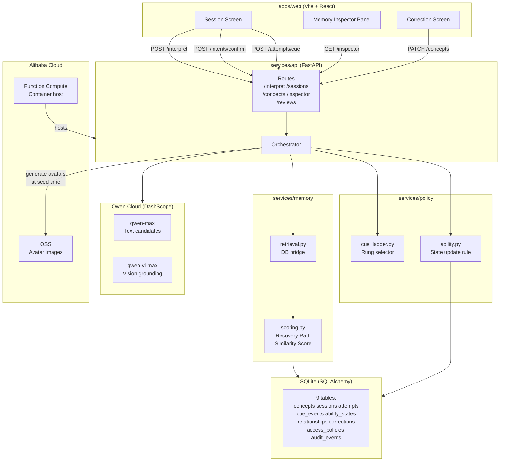

# ReVoice Architecture

## Component diagram

## Component descriptions

### Frontend (`apps/web/`)
Three React screens built with Vite + TypeScript:
- **Session Screen** — input area, up to 3 candidate intent cards (each with Confirm / Reject / Hint buttons), cue card display. Never auto-advances; every selection is explicit.
- **Memory Inspector Panel** — always visible alongside the session. Shows live score breakdowns per candidate, cue ladder with outcome indicators, ability state bar, and per-attempt latency. This is the primary demonstration of ReVoice's core mechanism.
- **Correction Screen** — pick a concept, enter a corrected label, save. The old label is marked superseded and excluded from all future retrievals.

### API (`services/api/`)
FastAPI application with 9 REST endpoints. The **orchestrator** (`orchestrator.py`) runs the deterministic pipeline: score memories → call Qwen → create attempt → await user confirmation → update ability state → write audit events. Qwen is called for exactly two things; all other decisions are deterministic Python.

### Memory (`services/memory/`)
- **`scoring.py`** — the Recovery-Path Similarity Score: `w1*relevance + w2*salience + w3*recovery_similarity + w4*uncertainty + w5*recency_transfer - w6*cost`, with two gates (consent check, supersession check) before scoring. Every scored candidate (including excluded ones) is written to `audit_events`.
- **`retrieval.py`** — bridges the ORM to the pure scoring layer, loading concepts, ability states, cue history, and policies from SQLite.

### Policy (`services/policy/`)
- **`cue_ladder.py`** — 4-rung ladder: photo/relationship (1) → semantic frame (2) → first letters (3) → full reveal (4). `select_next_cue()` is a pure function; the current `assistance_level` determines the starting rung.
- **`ability.py`** — `update_ability()` is a pure function: gap-decay on long absences, two-distinct-context threshold to reduce `assistance_level`, uncertainty bump on failure. No LLM involvement.

### Qwen Cloud (`services/qwen/`)
`client.py` wraps DashScope's OpenAI-compatible endpoint. Two functions:
1. `propose_candidate_intents()` — text or vision model, JSON structured output, returns ≤3 candidates with a "why" field.
2. `generate_review_summary()` — nonclinical plain-English summary from ability states.
A mock client (default when `USE_MOCK_QWEN=true`) makes the full app testable without an API key.

### Storage (`services/storage/`)
`oss_client.py` uses the `oss2` SDK to upload avatar PNGs to Alibaba Cloud OSS and return signed URLs. Falls back to local `file://` URLs when credentials are absent.

### Database (`packages/schemas/`)
SQLite via SQLAlchemy ORM. 9 tables: `concepts`, `relationships`, `sessions`, `attempts`, `cue_events`, `corrections`, `ability_states`, `access_policies`, `audit_events`. A swap to Postgres + pgvector for production would require only changing `DATABASE_URL`.
