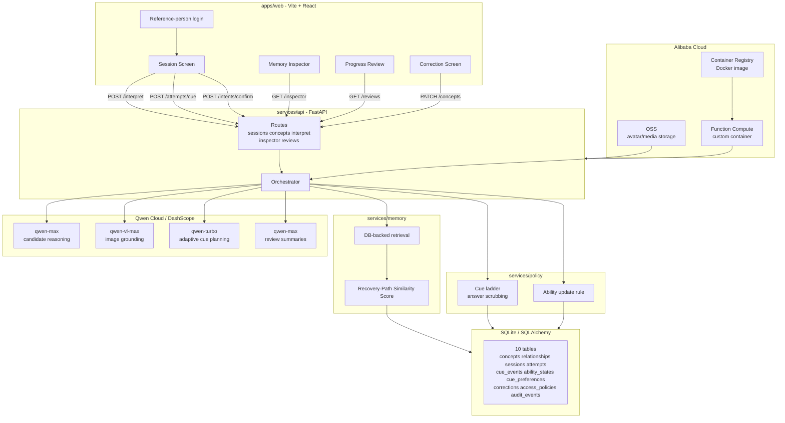

# ReVoice Architecture

## Component Diagram

## Core Flow

1. The user enters a stand-in phrase such as `granddaughter`, `blue paper`, or `my usual drink`, or uploads an image.
2. ReVoice retrieves candidate memories from SQLite and ranks them with the Recovery-Path Similarity Score.
3. Qwen receives only the top packed memories and proposes up to three candidate meanings.
4. The UI hides exact answers during recall practice as `Possible person match`, `Possible drink/order match`, etc.
5. If the user asks for help, Qwen generates an adaptive cue bank using concept category, relationship context, session context, and learned cue preferences.
6. Deterministic cue-ladder code sanitizes every pre-reveal cue so the exact target answer appears only at final reveal.
7. Each cue outcome updates `cue_events`, `ability_states`, and the user/category-level `cue_preferences` table.
8. Future Qwen cue planning receives those learned preferences, so new concepts for the same user start with cue styles that have worked before.

## Memory Model

ReVoice stores more than facts. It stores a **recovery path**:

- Which concept the user was trying to retrieve.
- Which cue style was shown.
- Whether the cue succeeded or failed.
- The current assistance level for that concept.
- Which cue strategies work best for this user and category.

This lets the system evolve in two ways:

- **Concept-level adaptation:** Lily, Michael, Sarah, and other memories each get easier prompts after successful recall.
- **User-level transfer:** If Margaret responds well to personal/semantic cues for people, a newly added person for Margaret inherits that cue preference.

## Qwen Usage

`services/qwen/client.py` wraps Qwen Cloud through DashScope's OpenAI-compatible API.

- `qwen-max`: candidate reasoning from packed memory context.
- `qwen-vl-max`: image-grounded input when the user uploads a photo.
- `qwen-turbo`: adaptive cue-bank generation.
- `qwen-max`: review summary generation.

The Memory Inspector exposes Qwen mode/model metadata so judges can see whether the app is running live Qwen or mock mode.

## Safety And Control

- Every candidate requires explicit user confirmation.
- The exact target label is hidden before final reveal.
- Qwen-generated hints are scrubbed by deterministic code before display.
- Caregiver-only concepts are gated before ranking.
- Corrections supersede old concepts instead of deleting history.
- Progress review uses nonclinical language and does not claim diagnosis or treatment.

## Deployment

The production submission path uses Alibaba Cloud:

- **Function Compute** hosts the FastAPI app and built frontend in a custom container.
- **Container Registry** stores the Docker image.
- **OSS** can host uploaded/generated persona images.
- **Qwen Cloud / DashScope** provides model inference.

See [DEPLOY.md](../DEPLOY.md) for the full command sequence.
